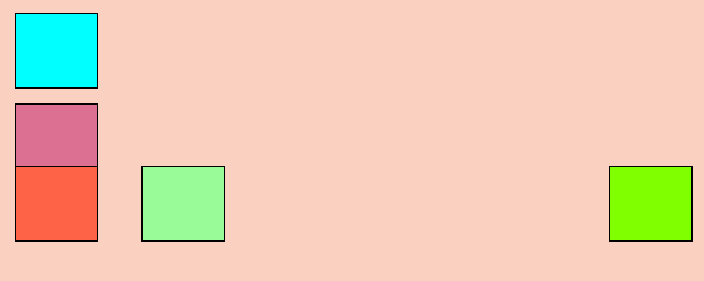

# [Bootcamp Web Developer Full Stack](https://www.thebridge.tech/bootcamps/bootcamp-fullstack-developer/)

### JS, ES6, Node.js, Frontend, Backend, Express, React, MERN, testing, DevOps

# **Tema 3** -  Modelo de cajas y position

## Modelo de cajas
***
En CSS aparte de aplicar estilos, podemos darle otras propiedades. Para ello debemos ser consciente que cada elemento de html tiene una serie de características comunes. Cada elemento es un contenedor, al que comunmente llamamos caja, la cual está estructurada por varias partes: 

- **content**: el espacio que ocupa el contenido del elemento (texto e imágenes).

- **padding**: el espacio que hay entre el borde y el contenido. Podríamos entenderlo como un relleno que según su tamaño hará que haya más separación entre el contenido y el borde, y por lo tanto, ocupe más la caja.

- **border**: es un borde que rodea al contenido y al padding, es transparente y permite definir un espacio específico entre los elementos. 

- **margin**: el margen es un área transparente, el cual, al manipularlo, podemos hacer que nuestro elemento se posicione según los valores que le hemos indicado. 

Las cajas por otro lado, tienen un ancho(width) y un alto(height) por defecto. Estos valores vienen dados por lo que ocupa el contenido del elemento, más el padding, el border y el margen. Podemos modificarlo según nuestras necesidades y el elemento se esparcirá por todo ese espacio que le hayamos delimitado. 

Podemos especificar, además, el lado del margin, padding, border al que queramos aplicar esta propiedad, por lo que bastaría con añadir a estas propiedades, la dirección:

- **-top**: selecciona la parte de arriba de la propiedad elegida.
- **-bottom**: selecciona la parte de abajo de la propiedad elegida.
- **-left**: selecciona la parte izquierda de la propiedad elegida.
- **-right**: selecciona la parte derecha de la propiedad elegida.

#### ¿Cómo escribirlo en código?

```html
    <div class="one"></div>
    <div class="two"></div>
```

```css
    div.one {
        background-color: purple;
        width: 300px;
        border-left: 5px solid black;
        padding: 30px;
        margin: 50px;
    }

    div.two {
        background-color: black;
        width: 200px;
        border: 5px solid white;
        padding-top: 30px;
        margin-bottom: 50px;
    }

```

#### ¿Cómo se vería representado?


#### Recursos

[Modelo de cajas](https://www.w3schools.com/css/css_boxmodel.asp)


## Posicionamiento
***
Los elementos también pueden posicionarse. Según el tipo de posicionamiento que apliquemos al elemento este se situará en una posición y tendrá unas características específicas, como veremos a continuación. 

Existen distintos valores posibles para el posicionamiento: static, relative, fixed, absolute, sticky.

- **static**: esta es su posición por defecto. En su posición afectarán el tamaño del margen, del border y del padding, pero no se aplicará ningún efecto más. 

- **relative**: como su propio nombre indica, el elemento se posicionará de forma relativa a su posición por defecto, por ello, en la posición relativa debemos indicar con las propiedades *left*, *right*, *top*, *bottom*, según la que necesitemos, con cuanta distancia estará posicionado el elemento de su posición por defecto.

- **fixed**: al igual que la posición relativa, la posición fixed se posiciona de forma relativa, por ello también se utilizarán las propiedades left, right, top y/o bottom. La diferencia con el anterior, es que, al hacer scroll en el navegador, la posición se mantiene siempre en las dimensiones y posición que le hemos indicado. Por ejemplo, si yo hago scroll y mi elemento tiene posición fixed, con left: 20px; top:20px independientemente de la parte de la página en la que esté, el elemento seguirá visible en la página, con un left de 20px y un top de 20px.

- **absolute**: este tipo de posición toma como referencia la posición del elemento anterior. Dependiendo de la posición del antecesor, así será su posición.

- **sticky**: esta posición se posiciona de forma relativa hasta el momento que le indiquemos, entonces al hacer scroll el usuario, en dicho momento, cambiará a posición fija volviendo a su posición inicial. 

#### ¿Cómo escribirlo en código?

```html
    <div class="one"></div>
    <div class="two"></div>
    <div class="three"></div>
    <div class="four"></div>
    <div class="five"></div>
```
```css
    div {
        width: 100px;
        height: 100px;
    }

    div.one {
        background-color: aqua;
        position: static;
        border: 2px solid black;
    }

    div.two {
        background-color: palevioletred;
        position: relative;
        top: 20px;
        border: 2px solid black;
    }

    div.three {
        background-color: palegreen;
        position: fixed;
        left: 200px;
        border: 2px solid black;
    }

    div.four {
        background-color: chartreuse;
        position: absolute;
        right: 38px;
        border: 2px solid black;
    }

    div.five {
        background-color: tomato;
        position: sticky;
        top: 0;
        border: 2px solid black;
    }

```

#### ¿Cómo se vería representado?


#### Recursos

- [Posicinamiento](https://www.w3schools.com/css/css_positioning.asp)

